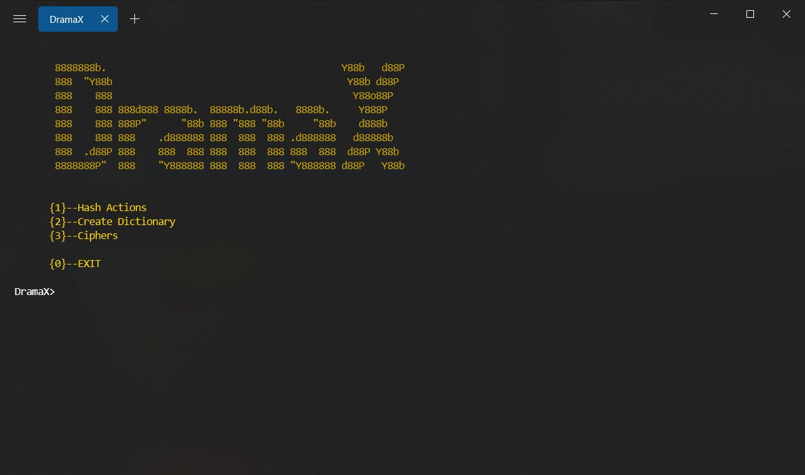

# DramaX
 Password and text cracking tools in Python
> ### I am currently rebuilding Dramax from scratch. There might be some issues while working with repository

 

# Introduction
`DramaX` is a tool to help you crack passwords and encypted text easier. It supports different Hash types ([full list](#list-of-supported-hashes)), many Ciphers ([full list](#)). You can also make dictionaries with different options.

 

# Modules

## Hash Actions
A set of actions are provided related to hashes like `Decrypting` or `Identifying`. 

#### List of supported hashes:
  - md5
  - sha1
  - sha2 (224,256,384,512)
  - sha3 (224,256,384,512)

### Hash-Decrypter

You can decrypt hashed text with this tool. For supported hashes see [here](#list-of-supported-hashes)
  - Step 1:
    - First you need to enter your hashed text
  - Step 2:
    - Select the hash method you text is encrypted (if you do not know about the hash type, check [here](#hash-identifiers) section)
  - Step 3:
    - Now you need to pass `path` of your dictionary files (absolute path is prefered incase you are not sure where is your current working directory)
    - Keep entering you dictionaries. when you are done, enter `end` to go to next stage
    - Now DramaX starts searching for your word 

<!--   -->

### Hash-Generator
This is a very simple tool. Only thing you need to do is to enter the text you want to hash and it will generate the hashed text for all [supported](#list-of-supported-hashes) hashes.

<!--   -->

### Hash-Identifiers
If you are not sure about the method your text has been hashed, this module is useful. Currently there are 3 hash-identifiers in the repository. Pick the one that you prefer and then enter your hashed text to see the predictions about it.

Link to original repositories of these hash identifiers:
  - [psypanda/hashID](https://github.com/psypanda/hashID)
  - [blackploit/hash-identifier](https://github.com/blackploit/hash-identifier)
  - [AnimeshShaw/Hash-Algorithm-Identifier](https://github.com/AnimeshShaw/Hash-Algorithm-Identifier)

 

## Dictionaries

Dictionaries are useful in several cases like measuring password securities, bruteforcing. etc.
This module provides several functionalities to create dictionaries

### Dictionary Creator
You can create dictionaries with `DictionaryCreator` tool in this module.
  - Step 1:
    - Enter the character list you want your dictionary to contain. *(Note that duplicate characters are **not** skipped)*
  - Step 2:
    - Enter maximum length of your dictionary words. It should be and integer higher than 0. 
  - Step 3:
    - Now enter the file path you want to save your dictionary
  - Step 4:
    - If your dictionary is too large (like more than 50 million words), it is better to use save memory option
  - Step 5:
    - Now just wait until all possible combinations are computed and your dictionary file be created
